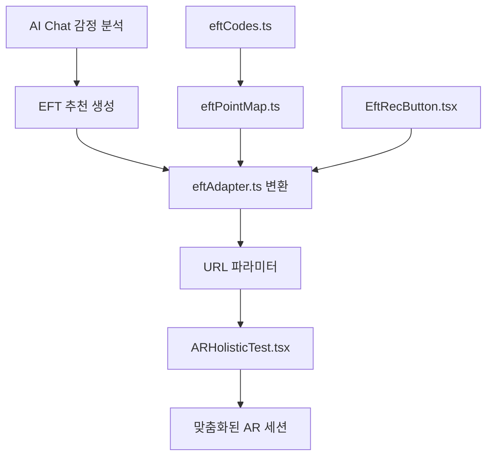

# 기술 명세서: AI → EFT 추천 시스템 통합

## 📋 **시스템 아키텍처**



## 🔧 **핵심 컴포넌트 API**

### **EftRecButton 컴포넌트**
```typescript
interface EftRecButtonProps {
  rec: EFTRecommendation;     // AI 추천 데이터
  index: number;              // 버튼 인덱스 (테스트용)
  onStart: (r: EFTRecommendation) => void; // 세션 시작 콜백
}

// 사용법
<EftRecButton
  rec={{
    emotion: "anxiety",
    intensity: 8,
    tapping_points: ["EB", "UE", "CH"],
    duration_minutes: 0.75,
    technique_name: "스트레스 완화",
    additional_notes: "깊게 호흡하세요"
  }}
  index={0}
  onStart={goAR}
/>
```

### **eftAdapter 변환 함수**
```typescript
function recToARParams(
  rec: EFTRecommendation,
  extra?: Record<string, string>
): URLSearchParams

// 변환 예시
const rec = {
  emotion: "stress",
  intensity: 8,
  tapping_points: ["EB", "SE", "UE"],
  duration_minutes: 0.75
};

const params = recToARParams(rec);
// 결과: ?emotion=stress&intensity=8&points=EB,SE-L,SE-R,UE&duration=45&...
```

### **ARHolisticTest 파라미터 스키마**
```typescript
interface ARParams {
  emotion: "anger" | "anxiety" | "sadness" | "stress" | "fear" | ...;
  intensity: number;        // 0-10 (SUDS 척도)
  points: EFTCode[];       // ["TH","EB","SE-L","SE-R","UE","UN","CH","CB"]
  durationSec: number;     // 15-600초
  rounds: number;          // 1-20라운드
  tempoBpm: number;        // 30-120 BPM
  side: "both" | "left" | "right";
  affirm?: string;         // 확언 문구 (선택)
}
```

## 🎯 **데이터 플로우**

### **1단계: AI 감정 분석**
```typescript
// AIChat.tsx
const userInput = "요즘 업무 스트레스가 심해요";
const aiResponse = await chatAPI(userInput);
// AI가 감정 키워드 감지 → EFT 추천 생성
```

### **2단계: EFT 추천 생성**
```typescript
const recommendation: EFTRecommendation = {
  emotion: "stress",           // AI 분석 결과
  intensity: 7,               // 1-10 척도
  tapping_points: ["TH", "EB", "CB"], // 추천 포인트
  duration_minutes: 1,        // 추천 지속시간
  technique_name: "업무 스트레스 완화",
  additional_notes: "깊게 호흡하며 진행하세요"
};
```

### **3단계: 파라미터 변환**
```typescript
// eftAdapter.ts에서 자동 처리
const rawPoints = ["TH", "EB", "CB"];           // AI 추천
const normalized = normalizePoints(rawPoints);   // 정규화
const arCompatible = reconcileForAR(normalized); // AR 호환성
const finalPoints = ["TH", "EB", "CB"];         // 최종 결과
```

### **4단계: URL 생성 및 네비게이션**
```typescript
const params = recToARParams(recommendation);
navigate(`/ar-holistic?${params.toString()}`);
// URL: /ar-holistic?emotion=stress&intensity=7&points=TH,EB,CB&duration=60&rounds=3&tempo=50&side=both
```

### **5단계: AR 세션 맞춤화**
```typescript
// ARHolisticTest.tsx에서 자동 파싱
const [searchParams] = useSearchParams();
const arParams = parseARParams(searchParams);

// 실시간 적용
const currentPoint = arParams.points[
  (Math.floor(elapsed / stepPerPoint)) % arParams.points.length
]; // TH → EB → CB 순환
```

## 🛡️ **안전성 및 검증**

### **입력 검증 (parseARParams)**
```typescript
function parseARParams(sp: URLSearchParams): ARParams {
  return {
    emotion: pickEnum(sp.get("emotion"), ALLOWED_EMOTIONS, "stress"),
    intensity: clamp(parseInt(sp.get("intensity") || "6"), 0, 10),
    points: normalizePoints(sp.get("points")?.split(",") || []),
    durationSec: clamp(parseInt(sp.get("duration") || "60"), 15, 600),
    rounds: clamp(parseInt(sp.get("rounds") || "3"), 1, 20),
    tempoBpm: clamp(parseInt(sp.get("tempo") || "50"), 30, 120),
    side: ["both","left","right"].includes(sp.get("side")||"")
      ? sp.get("side") as SideKey : "both",
    affirm: sp.get("affirm") || undefined
  };
}
```

### **포인트 정규화 (normalizePoints)**
```typescript
function normalizePoints(input: string[]): EFTCode[] {
  const out: EFTCode[] = [];

  for (const raw of input) {
    const key = raw.trim().toUpperCase();

    // 제외 대상 처리
    if (key === "UA") {
      console.warn("[EFT] UA(겨드랑이) 포인트는 지원하지 않아 제외합니다.");
      continue;
    }

    // 확장 처리
    if (key === "SE") {
      out.push("SE-L", "SE-R");
      continue;
    }

    // 화이트리스트 검증
    if (ALLOWED_POINTS.has(key as EFTCode)) {
      out.push(key as EFTCode);
    } else {
      console.warn(`[EFT] 미지원 포인트 '${key}'는 제외합니다.`);
    }
  }

  return Array.from(new Set(out)); // 중복 제거
}
```

## 🎨 **시각적 렌더링 사양**

### **현재 포인트 하이라이트**
```typescript
// 펄스 글로우 효과
const pulseScale = 1.5 + Math.sin(t * 0.008) * 0.3; // 1.2~1.8배
ctx.beginPath();
ctx.arc(p.x, p.y, 15 * pulseScale, 0, Math.PI * 2);
ctx.strokeStyle = "rgba(255,255,0,0.8)";
ctx.lineWidth = 4;
ctx.stroke();
```

### **정보 오버레이**
```typescript
// 감정/강도 pill (좌상단)
drawPill(ctx, 10, 10, `감정: ${emotion} (${intensity}/10)`, {
  font: "14px system-ui, sans-serif",
  box: "rgba(0,0,0,0.6)",
  color: "rgba(255,255,255,0.95)"
});

// 확언 래핑 (중앙)
drawCenteredWrapped(ctx, canvas, affirmText, {
  font: "18px system-ui, sans-serif",
  maxWidthRatio: 0.9,
  lineHeight: 28,
  box: "rgba(0,0,0,0.45)"
});
```

### **사이드 필터링**
```typescript
function allowBySide(index: number, side: SideKey): boolean {
  if (side === "both") return true;
  if (side === "left") return LEFT_IDX.has(index);
  return RIGHT_IDX.has(index); // "right"
}

// 적용
allPoints.forEach(({key, label, color}) => {
  if (key === "SE-L" && arParams.side === "right") return;
  if (key === "SE-R" && arParams.side === "left") return;
  drawPoint(key, label, color, currentPoint === key);
});
```

## 📊 **성능 최적화**

### **메모이제이션**
```typescript
const EftRecButton = React.memo(function EftRecButton(props) {
  // props 변경 시에만 리렌더링
});

const stepPerPoint = useMemo(() =>
  Math.max(1, Math.floor(arParams.durationSec / Math.max(1, arParams.points.length))),
  [arParams.durationSec, arParams.points.length]
);
```

### **RAF 최적화**
```typescript
const drawOverlay = (t: number) => {
  // 정확한 타이밍 제어
  const now = performance.now();

  // 가이드 엔진 업데이트
  if (guideEngineRef.current.running) {
    updateGuideEngine(now);
  }

  // 시각적 렌더링
  renderPoints(now);
  renderOverlays(now);

  rafRef.current = requestAnimationFrame(drawOverlay);
};
```

## 🔍 **디버깅 및 모니터링**

### **개발 모드 로깅**
```typescript
if (process.env.NODE_ENV !== "production") {
  console.debug("[AR] URL Params →", arParams);
  console.debug("[AR] Current Point →", currentPoint);
  console.debug("[AR] Elapsed/Duration →", elapsed, "/", arParams.durationSec);
}
```

### **에러 추적**
```typescript
// 포인트 정규화 시 경고
console.warn("[EFT] UA(겨드랑이) 포인트는 지원하지 않아 제외합니다.");
console.warn(`[EFT] 미지원 포인트 '${key}'는 제외합니다.`);

// 오디오 실패 시 graceful 처리
try {
  playBeep(frequency, duration);
} catch (e) {
  console.warn("AudioContext error", e);
}
```

## 🧪 **테스트 케이스**

### **단위 테스트**
```typescript
describe("normalizePoints", () => {
  it("should handle UA removal", () => {
    expect(normalizePoints(["EB", "UA", "CH"])).toEqual(["EB", "CH"]);
  });

  it("should expand SE to SE-L/SE-R", () => {
    expect(normalizePoints(["SE"])).toEqual(["SE-L", "SE-R"]);
  });

  it("should remove duplicates", () => {
    expect(normalizePoints(["EB", "EB", "UE"])).toEqual(["EB", "UE"]);
  });
});
```

### **통합 테스트**
```typescript
describe("AI → AR Integration", () => {
  it("should convert AI recommendation to valid AR params", () => {
    const rec = { emotion: "stress", intensity: 8, tapping_points: ["EB", "SE"] };
    const params = recToARParams(rec);

    expect(params.get("emotion")).toBe("stress");
    expect(params.get("intensity")).toBe("8");
    expect(params.get("points")).toBe("EB,SE-L,SE-R");
  });
});
```

### **E2E 테스트 시나리오**
1. AI 채팅에서 스트레스 표현
2. EFT 추천 버튼 생성 확인
3. 버튼 클릭 → AR 페이지 이동
4. 파라미터 정상 파싱 확인
5. 추천 포인트가 정확히 하이라이트되는지 확인

## 📚 **참고 문서**

- [React Router - useSearchParams](https://reactrouter.com/en/main/hooks/use-search-params)
- [MediaPipe Holistic](https://google.github.io/mediapipe/solutions/holistic.html)
- [WCAG 2.1 AA Guidelines](https://www.w3.org/WAI/WCAG21/AA/)
- [TypeScript Utility Types](https://www.typescriptlang.org/docs/handbook/utility-types.html)

---

**문서 버전**: 1.0
**최종 수정**: 2025.09.21
**담당자**: AI Development Team