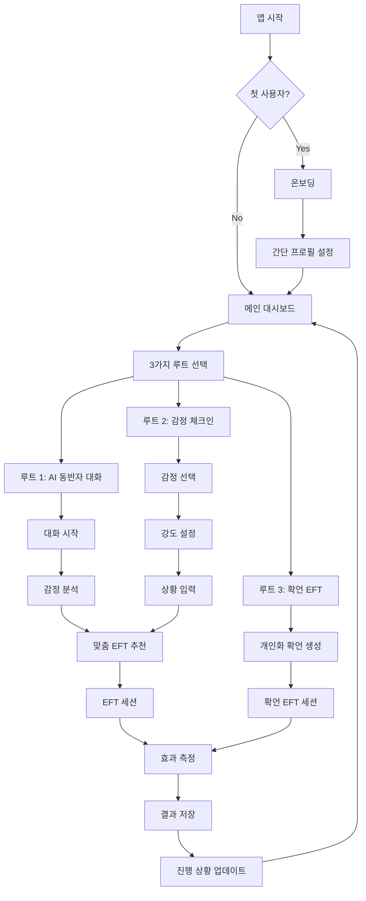

# UI/UX 화면 설계 및 흐름도

**프로젝트**: EFT AI 마음챙김 앱  
**작성일**: 2025년 8월 15일

---

## 📱 전체 화면 구조

### **앱 아키텍처**
```
EFT AI 앱
├── 온보딩 (첫 사용자)
├── 메인 대시보드 (홈)
├── 3가지 루트 선택
├── 루트별 세부 화면들
├── 진행 상황 추적
└── 설정 및 프로필
```

---

## 🎯 화면 흐름도

### **전체 사용자 플로우**


---

## 📋 상세 화면 설계

### **1. 온보딩 화면 (3단계)**

#### **1-1. 환영 화면**
```
┌─────────────────────────┐
│     [EFT 로고]          │
│                         │
│   EFT AI 마음챙김       │
│                         │
│ "당신만의 AI 동반자와    │
│  함께하는 마음 여행"     │
│                         │
│     [시작하기]          │
│                         │
│ "3분이면 준비 완료"      │
└─────────────────────────┘
```

#### **1-2. 권한 요청**
```
┌─────────────────────────┐
│    📱 알림 권한         │
│                         │
│ 맞춤 케어 알림을         │
│ 받으시겠어요?           │
│                         │
│ • 예측적 케어 알림       │
│ • 일상 체크인 리마인더   │
│ • 성장 축하 메시지       │
│                         │
│  [허용하기] [나중에]    │
└─────────────────────────┘
```

#### **1-3. 간단 프로필**
```
┌─────────────────────────┐
│  마지막 단계예요! 😊     │
│                         │
│ 닉네임: [________]      │
│                         │
│ 주로 언제 사용하실까요?  │
│ ○ 아침 (에너지 충전)    │
│ ○ 점심 (스트레스 해소)  │
│ ○ 저녁 (하루 정리)      │
│                         │
│ 데이터 수집 동의         │
│ ☑️ 개인화 서비스 제공   │
│ □ 익명 사용 패턴 분석    │
│                         │
│    [완료하기]           │
└─────────────────────────┘
```

### **2. 메인 대시보드 (혁신적 기능 포함)**

```
┌─────────────────────────┐
│ ☰  EFT 마음챙김  🔔🏆   │ ← Header + 등급 표시
├─────────────────────────┤
│  🌿 마음탐험가 김민수님  │ ← 사용자 등급 + 닉네임
│    👋 안녕하세요!       │
│    오늘은 어떤 하루인가요?│
│                         │
│ ┌─────────────────────┐ │
│ │  오늘의 마음 날씨    │ │
│ │     ☀️ 맑음        │ │ 
│ │  (어제보다 +2점)    │ │
│ └─────────────────────┘ │
│                         │
│ 💡 AI 추천               │
│ "최근 패턴을 보니 오후에 │
│  스트레스가 올 수 있어요. │
│  미리 준비해볼까요?"      │
│                         │
│ ┌───────┬───────┬───────┐│
│ │🗣️ 대화  │❤️ 체크인│✨확언 ││ ← 3가지 루트
│ │AI동반자│감정진단 │EFT   ││
│ └───────┴───────┴───────┘│
│                         │
│ 🔮 나에 대한 통찰        │ ← 🆕 혁신 기능!
│ ┌─ 해제됨 ─┬─ 잠금 ─┐   │
│ │✨"내 성격"│🔒 20/30│   │
│ │💕"연애성공"│🔒 5/50 │   │
│ └───────────┴───────┘   │
│ 💎 특별 질문: "발표 떨림"│ ← 🆕 개인맞춤!
│                         │
│ 📊 이번 주 성장          │
│ ▓▓▓▓▓░░ 72%   🏅 5일연속│
│                         │
│ 🏆 최근 세션 (3회)       │
│ • 오늘 오전: 스트레스 → 평온│
│ • 어제 저녁: 불안 → 안정  │
│ • 3일 전: 분노 → 수용     │
└─────────────────────────┘
│🏠 홈 │❤️체크인│🧘세션│🔮통찰│💬AI│ ← Bottom Nav
└─────────────────────────┘
```

### **3. 루트 선택 화면**

```
┌─────────────────────────┐
│ ← EFT 마음챙김          │
├─────────────────────────┤
│                         │
│ 오늘은 어떤 방식으로      │
│ 마음을 돌봐드릴까요? 💙   │
│                         │
│ ┌─────────────────────┐ │
│ │  🗣️ AI 동반자와     │ │
│ │     대화하기        │ │
│ │                     │ │
│ │ 자유롭게 마음 이야기 │ │
│ │ ⏱️ 15-25분          │ │
│ │ 🎯 깊은 탐색        │ │
│ └─────────────────────┘ │
│                         │
│ ┌─────────────────────┐ │
│ │  ❤️ 감정 체크인     │ │
│ │     하기            │ │
│ │                     │ │
│ │ 간단 선택으로 빠르게 │ │
│ │ ⏱️ 10-15분          │ │
│ │ ⚡ 즉시 케어        │ │
│ └─────────────────────┘ │
│                         │
│ ┌─────────────────────┐ │
│ │  ✨ 확언 EFT       │ │
│ │                     │ │
│ │ 맞춤 확언으로 힘 기르기│ │
│ │ ⏱️ 5-10분           │ │
│ │ 🌟 일상 루틴        │ │
│ └─────────────────────┘ │
│                         │
│ 💡 잘 모르겠다면        │
│    AI 동반자 추천!      │
└─────────────────────────┘
```

### **4. 루트 1: AI 동반자 대화**

#### **4-1. 대화 시작**
```
┌─────────────────────────┐
│ ← AI 동반자 대화        │
├─────────────────────────┤
│                         │
│  👋 AI: 안녕하세요!     │
│     저는 당신의 마음    │
│     돌봄을 도와주는     │
│     AI 동반자예요 💙    │
│                         │
│     오늘은 어떤 마음으로│
│     오셨나요?           │
│                         │
│ ┌─────────────────────┐ │
│ │ 메시지 입력...      │ │ ← 입력창
│ │                  [>]│ │
│ └─────────────────────┘ │
│                         │
│ 💡 이런 식으로 시작해보세요│
│ • "오늘 너무 힘들었어요" │
│ • "스트레스가 심해요"    │  
│ • "마음이 복잡해요"      │
└─────────────────────────┘
```

#### **4-2. 대화 진행 중**
```
┌─────────────────────────┐
│ ← AI 동반자 대화        │
├─────────────────────────┤
│                         │
│ 😊 You: 오늘 회사에서   │
│         너무 스트레스   │
│         받았어요...     │
│                         │
│ 🤖 AI: 힘드셨겠어요.    │
│        어떤 상황이      │
│        가장 부담스러    │
│        우셨나요?        │
│                         │
│ 😊 You: 상사가 계속     │
│         야근을 시켜서   │
│         지쳤어요        │
│                         │
│ 🤖 AI: 정말 지치셨을    │
│        것 같아요.       │
│        혹시 이런        │
│        패턴이 자주      │
│        반복되나요?      │
│                         │
│ [분석 중... 🧠]         │
│                         │
│ ┌─────────────────────┐ │
│ │ 메시지 입력...      │ │
│ └─────────────────────┘ │
└─────────────────────────┘
```

#### **4-3. AI 통찰 제공**
```
┌─────────────────────────┐
│ ← AI 동반자 대화        │
├─────────────────────────┤
│                         │
│ 🤖 AI: 말씀을 들어보니,  │
│        근본적으로는     │
│        '인정받고 싶은   │
│        마음' 이 큰      │
│        것 같아요.       │
│                         │
│        완벽해야만       │
│        안전하다고       │
│        느끼시는 패턴이   │
│        보입니다.        │
│                         │
│        이런 해석이      │
│        맞나요? 🤔       │
│                         │
│ ┌─────────────────────┐ │
│ │ ○ 맞는 것 같아요    │ │
│ │ ○ 부분적으로 맞아요 │ │
│ │ ○ 다르게 생각해요   │ │
│ └─────────────────────┘ │
│                         │
│ 💡 맞춤 EFT 세션을      │
│    추천해드릴게요!      │
│                         │
│ [맞춤 세션 시작] 🌿     │
└─────────────────────────┘
```

### **5. 루트 2: 감정 체크인**

#### **5-1. 감정 선택**
```
┌─────────────────────────┐
│ ← 감정 체크인           │
├─────────────────────────┤
│                         │
│  지금 어떤 감정이       │
│  가장 크시나요? ❤️      │
│                         │
│ ┌─────┬─────┬─────┐     │
│ │스트레│ 불안 │ 분노 │     │
│ │스 😰│ 😟  │ 😡  │     │
│ └─────┴─────┴─────┘     │
│                         │
│ ┌─────┬─────┬─────┐     │
│ │슬픔 │두려움│외로움│     │  
│ │😢  │ 😨  │ 😔  │     │
│ └─────┴─────┴─────┘     │
│                         │
│ ┌─────┬─────┬─────┐     │
│ │좌절감│질투 │수치심│     │
│ │😤  │ 😒  │ 😳  │     │
│ └─────┴─────┴─────┘     │
│                         │
│ ┌─────────────────────┐ │
│ │ 직접 입력하기        │ │ ← 커스텀 입력
│ │ "지금 느낌을 적어보세요"│ │
│ └─────────────────────┘ │
│                         │
│ [잘 모르겠어요] 🤷‍♀️     │ ← AI 가이드
└─────────────────────────┘
```

#### **5-2. 강도 설정**
```
┌─────────────────────────┐
│ ← 감정 체크인           │
├─────────────────────────┤
│                         │
│  선택하신 감정: 스트레스 😰│
│                         │
│  얼마나 강하게 느끼시나요?│
│                         │
│      현재 강도: 7/10     │
│         강함            │
│                         │
│ ●●●●●●●○○○             │
│ 1   3   5   7   9  10   │
│                         │
│ ┌─────────────────────┐ │
│ │  ●●●  시각적 표시   │ │
│ │ ●●●●● (7개 채워짐)  │ │
│ │  ●●●                │ │
│ └─────────────────────┘ │
│                         │
│ 💭 "업무 압박이 심해서   │
│     밤에 잠도 안 와요"   │
│                         │
│    [다음 단계] →        │
└─────────────────────────┘
```

#### **5-3. 상황 입력**
```
┌─────────────────────────┐
│ ← 감정 체크인           │
├─────────────────────────┤
│                         │
│  어떤 상황 때문인가요?   │
│                         │
│ ┌─────┬─────┬─────┐     │
│ │업무 │인간  │경제적│     │
│ │압박 │관계  │부담  │     │
│ └─────┴─────┴─────┘     │
│                         │
│ ┌─────┬─────┬─────┐     │
│ │가족 │건강  │시간  │     │
│ │갈등 │문제  │부족  │     │
│ └─────┴─────┴─────┘     │
│                         │
│ ✍️ 직접 설명하기         │
│ ┌─────────────────────┐ │
│ │상사가 계속 야근을    │ │
│ │시켜서 너무 지쳐요...│ │
│ └─────────────────────┘ │
│                         │
│ 🎯 AI 분석 결과:        │
│ "업무 경계 설정의 어려움"│
│                         │
│    [맞춤 EFT 시작]      │
└─────────────────────────┘
```

### **6. EFT 세션 화면**

#### **6-1. 세션 준비**
```
┌─────────────────────────┐
│ ← EFT 세션 가이드       │
├─────────────────────────┤
│                         │
│  맞춤 EFT 세션 준비완료! │
│                         │
│ 🎯 목표: 스트레스 완화   │
│ ⏱️ 예상 시간: 12분      │
│                         │
│ 📍 추천 포인트 (3개):    │
│ • 정수리 (압박감 완화)   │
│ • 쇄골 (전체 긴장 이완)  │
│ • 겨드랑이 (자기비판 완화)│
│                         │
│ 💬 맞춤 확언:           │
│ "이런 스트레스가 있지만, │
│  나는 나 자신을 깊이    │
│  사랑하고 받아들입니다"  │
│                         │
│ 🔧 준비하기:            │
│ • 편안한 자세로 앉기     │
│ • 깊게 3번 숨쉬기        │
│ • 현재 기분 7/10 기록    │
│                         │
│    [세션 시작하기]       │
└─────────────────────────┘
```

#### **6-2. 3D 가이드 (추후 구현)**
```
┌─────────────────────────┐
│ ← EFT 세션 (1/3 포인트) │
├─────────────────────────┤
│                         │
│      3D 아바타 영역     │
│    ╭─────────────────╮   │
│    │    🧑‍💼 3D 모델   │   │
│    │   (정수리 강조)   │   │
│    │        ↑        │   │
│    │     👆 탭핑      │   │
│    ╰─────────────────╯   │
│                         │
│ 🎯 정수리 포인트         │
│ "머리 꼭대기를 부드럽게  │
│  7-10회 두드려주세요"    │
│                         │
│ 💬 함께 말해보세요:      │
│ "이런 스트레스가 있지만..."│
│                         │
│ ⏱️ [●●●○○○○] 3초 남음   │
│                         │
│ 🔊 [음성 가이드 ON]     │
│    [일시정지] [다음]    │
└─────────────────────────┘
```

#### **6-3. 세션 완료**
```
┌─────────────────────────┐
│ ← EFT 세션 완료         │
├─────────────────────────┤
│                         │
│      🎉 수고하셨어요!    │
│                         │
│ 📊 변화 측정:           │
│                         │
│ 시작 전: ●●●●●●●○○○ (7)│
│ 현재:   ●●●●○○○○○○ (4)│
│                         │
│ 📈 개선도: +3점 (43%)   │
│                         │
│ 💭 어떠셨나요?          │
│ ⭐⭐⭐⭐⭐ (터치로 평가) │
│                         │
│ 🎯 오늘의 성과:         │
│ "스트레스 → 차분함"     │
│                         │
│ 💡 추가 제안:           │
│ • 오후 3시 체크인 알림   │
│ • 내일 아침 확언 EFT    │
│ • 심호흡 연습 5분       │
│                         │
│ [결과 저장] [다시 하기] │
│                         │
│      [홈으로] 🏠        │
└─────────────────────────┘
```

### **7. 루트 3: 확언 EFT**

#### **7-1. 개인화 확언 생성**
```
┌─────────────────────────┐
│ ← 확언 EFT             │
├─────────────────────────┤
│                         │
│  오늘의 맞춤 확언 ✨     │
│                         │
│ 🧠 AI가 당신의 패턴을    │
│    분석해서 만든 확언:   │
│                         │
│ ┌─────────────────────┐ │
│ │ "나는 완벽하지 않아도│ │
│ │  충분히 가치있는     │ │
│ │  사람입니다"         │ │
│ └─────────────────────┘ │
│                         │
│ 💡 이 확언이 좋으신가요? │
│ 👍 [좋아요] 👎 [다시]   │
│                         │
│ 🎨 다른 스타일:          │
│ • "나는 나를 사랑합니다" │
│ • "오늘도 최선을 다했어요"│
│ • "내 감정을 인정해요"   │
│                         │
│ ✍️ 직접 만들기:         │
│ ┌─────────────────────┐ │
│ │ 나만의 확언 입력... │ │
│ └─────────────────────┘ │
│                         │
│    [EFT 세션 시작]      │
└─────────────────────────┘
```

### **8. 🔮 혁신! 개인 통찰 잠금 해제 화면**

#### **8-1. 통찰 질문 대시보드**
```
┌─────────────────────────┐
│ ← 나에 대한 통찰 🔮     │
├─────────────────────────┤
│  💎 AI가 분석한 당신만의 │
│     깊은 통찰을 확인해보세요│
│                         │
│ 🌱 새싹 단계 (해제완료)  │
│ ┌─────────────────────┐ │
│ │ ✅ 나의 감정 패턴은? │ │
│ │ ✅ 스트레스 상황분석 │ │
│ └─────────────────────┘ │
│                         │
│ 🌿 성장 단계 (진행중)    │
│ ┌─────────────────────┐ │
│ │ ✨ 나는 어떤 성격?   │ │ ← 해제됨!
│ │ 🔒 연애를 성공하려면? │ │
│ │    진행률: 15/30     │ │
│ │ 🔒 나의 보완점은?   │ │
│ │    진행률: 8/30      │ │
│ └─────────────────────┘ │
│                         │
│ 💎 특별 맞춤 질문        │
│ ┌─────────────────────┐ │
│ │ 🌟 발표할 때 떨지   │ │ ← AI 생성!
│ │    않으려면?        │ │
│ │ "당신의 발표 고민을  │ │
│ │  위한 맞춤 분석"    │ │
│ └─────────────────────┘ │
│                         │
│ [질문하기] [설정] [도움말]│
└─────────────────────────┘
```

#### **8-2. 질문 상세 화면**
```
┌─────────────────────────┐
│ ← 나는 어떤 성격? ✨    │
├─────────────────────────┤
│                         │
│  🧠 AI 분석 결과        │
│     (신뢰도 80%)        │
│                         │
│ ┌─────────────────────┐ │
│ │ 성격 유형: INFP 성향 │ │
│ │ 주요 특성:          │ │
│ │ • 높은 공감능력 💝   │ │
│ │ • 완벽주의 성향 🎯  │ │ 
│ │ • 내성적 에너지 🌙  │ │
│ │                     │ │
│ │ 강점:               │ │
│ │ • 깊이있는 사고     │ │
│ │ • 창의적 문제해결   │ │
│ │ • 진정성 있는 소통  │ │
│ │                     │ │
│ │ 주의점:             │ │
│ │ • 자기비판 경향     │ │
│ │ • 변화에 대한 불안  │ │
│ └─────────────────────┘ │
│                         │
│ 💡 성장 제안:           │
│ "자기 수용 연습이 도움이 │
│  될 것 같아요"          │
│                         │
│ [상세 리포트] [EFT 추천]│
│     [결과 공유]         │
└─────────────────────────┘
```

#### **8-3. 개인 맞춤 질문 생성 알림**
```
┌─────────────────────────┐
│      🎉 축하합니다!     │
├─────────────────────────┤
│                         │
│  💎 당신만을 위한       │
│     특별 질문이 생성되었어요!│
│                         │
│ ┌─────────────────────┐ │
│ │ "내가 발표할 때      │ │
│ │  떨지 않으려면?"    │ │
│ │                     │ │
│ │ 🎯 분석 근거:        │ │
│ │ • "발표" 7회 언급   │ │
│ │ • "긴장" 패턴 감지  │ │
│ │ • 스트레스 연관성   │ │
│ └─────────────────────┘ │
│                         │
│  ✨ 이 질문은 20번의    │
│     대화를 분석해서     │
│     만들어졌어요!       │
│                         │
│ 🏆 새로운 뱃지 획득:     │
│ "맞춤 통찰 해제자"      │
│                         │
│ [지금 질문하기] [나중에] │
└─────────────────────────┘
```

### **9. 사용자 등급 & 뱃지 화면**

#### **9-1. 내 등급 정보**
```
┌─────────────────────────┐
│ ← 나의 성장 여정 🏆     │
├─────────────────────────┤
│                         │
│    현재 등급: 🌿        │
│   마음탐험가 (Lv.2)     │
│                         │
│ ┌─────────────────────┐ │
│ │ 경험치: 1,247 XP     │ │
│ │ 다음 등급까지: 753   │ │
│ │ ▓▓▓▓▓▓▓░░░ 62%      │ │
│ └─────────────────────┘ │
│                         │
│ 🎯 다음 등급: 🌳 자아발견자│
│                         │
│ 🏆 보유 뱃지 (8개):      │
│ ┌───┬───┬───┬───┐     │
│ │🔥7│💎3│🌟1│⚡5│     │
│ │일연│해제│성장│즉시│     │
│ │속 │완료│마스│케어│     │
│ └───┴───┴───┴───┘     │
│                         │
│ 📊 내 기록:             │
│ • 총 대화: 47회         │
│ • EFT 세션: 23회        │
│ • 평균 개선도: +2.8점   │
│ • 연속 사용: 12일       │
│                         │
│ 🎖️ 특별 성과:           │
│ "스트레스 마스터"       │
│ "감정 분석 전문가"      │
│                         │
│ [친구 초대] [랭킹 보기] │
└─────────────────────────┘
```

### **10. 진행 상황 추적 (업그레이드)**

```
┌─────────────────────────┐
│ ← 나의 성장 여정 📊     │
├─────────────────────────┤
│ 🌿 마음탐험가 레벨      │
│  📊 이번 주 요약        │
│                         │
│ ┌─────────────────────┐ │
│ │ 세션 참여: 8회       │ │
│ │ 평균 개선도: +3.2점  │ │  
│ │ 연속 사용: 5일 🔥    │ │
│ │ 새 통찰 해제: 2개 💎 │ │ ← 🆕
│ └─────────────────────┘ │
│                         │
│ 📈 감정 변화 그래프:     │
│ 스트레스 ──────\___     │
│ 불안     ────────\__    │  
│ 평온     ___/─────      │
│          월 화 수 목 금   │
│                         │
│ 🏆 이번 주 성과:        │
│ • "자기비판 90% 감소"   │
│ • "예측 케어 성공 3회"   │
│ • "새로운 패턴 발견"    │
│ • 🆕 "맞춤 질문 2개 생성"│
│                         │
│ 💡 AI 통찰:             │
│ "목요일 오후 스트레스   │
│  패턴이 개선되고 있어요!"│
│                         │
│ 🎯 다음 목표:           │
│ "발표 불안 극복하기"    │ ← 🆕 개인화된 목표
│                         │
│ 🎮 게임 요소:           │
│ • XP 획득: +245 (이번주)│
│ • 뱃지 획득: 1개        │
│ • 다음 레벨까지: 753 XP │
│                         │
│ [상세 분석] [통찰 보기] │
└─────────────────────────┘
```

---

## 🎨 디자인 가이드라인

### **색상 시스템 (임시)**
```
Primary: #3B82F6 (파랑)
Secondary: #8B5CF6 (보라)  
Accent: #10B981 (초록)

Emotion Colors:
- 스트레스: #FF6B6B (빨강)
- 불안: #FFB347 (주황)
- 평온: #4ECDC4 (청록)  
- 기쁨: #FFE66D (노랑)
```

### **타이포그래피**
```
Heading 1: 24px, Bold
Heading 2: 20px, Semibold  
Heading 3: 18px, Medium
Body: 16px, Regular
Caption: 14px, Regular
Small: 12px, Regular
```

### **간격 시스템**
```
XS: 4px
SM: 8px  
MD: 16px
LG: 24px
XL: 32px
XXL: 48px
```

### **🆕 게임화 요소 디자인**
```
잠금 상태:
- 배경: rgba(gray, 0.3)
- 아이콘: 🔒
- 텍스트: gray-400
- 애니메이션: 없음

해제 직전:
- 배경: rgba(yellow, 0.1) 
- 아이콘: ⏳
- 텍스트: yellow-600
- 프로그레스바: 진행률 표시

해제 완료:
- 배경: gradient-gold
- 아이콘: ✨ 
- 텍스트: black
- 애니메이션: sparkle 효과

개인 맞춤:
- 배경: gradient-rainbow
- 아이콘: 💎
- 텍스트: white
- 애니메이션: rainbow-glow
```

### **🆕 등급별 색상 시스템**

#### **현재 등급 시스템 (임시)**
```
새싹탐험가: #22C55E (초록)
감정연구자: #3B82F6 (파랑)  
마음탐험가: #8B5CF6 (보라)
자아발견자: #F59E0B (주황)
심리마스터: #EF4444 (빨강)
마음의현자: #FFD700 (금색)
```

#### **🎮 유명 게임 스타일 등급 시스템 (검토 중)**

**리그 오브 레전드 스타일 (1안)**
```
🥉 브론즈: #CD7F32 (브론즈 색상)
🥈 실버: #C0C0C0 (실버 색상)
🥇 골드: #FFD700 (골드 색상)
💎 플래티넘: #E5E4E2 (플래티넘 색상)
💍 다이아몬드: #B9F2FF (다이아몬드 블루)
👑 마스터: #9400D3 (퍼플)
🏆 그랜드마스터: #FF0040 (레드)
```

**EFT 앱 맞춤형 등급명 (2안)**
```
🥉 마음새싹 (Bronze Rookie): #CD7F32
🥈 감정탐험가 (Silver Explorer): #C0C0C0
🥇 심리마스터 (Gold Master): #FFD700
💎 힐링전문가 (Platinum Healer): #E5E4E2
💍 마음연금술사 (Diamond Alchemist): #B9F2FF
👑 감정현자 (Master Sage): #9400D3
🏆 EFT레전드 (Grandmaster Legend): #FF0040
```

**발로란트 스타일 (3안)**
```
🔩 아이언: #8B7D6B (아이언 그레이)
🥉 브론즈: #CD7F32 (브론즈)
🥈 실버: #C0C0C0 (실버)
🥇 골드: #FFD700 (골드)
💎 플래티넘: #E5E4E2 (플래티넘)
💍 다이아몬드: #B9F2FF (다이아몬드)
🦅 이모탈: #FF6B6B (레드)
👑 레디언트: #FFD700 (골든 크라운)
```

---

## 📱 반응형 고려사항

### **모바일 우선 설계**
- 최소 너비: 320px
- 터치 타겟: 최소 44px
- 한 손 조작 가능한 네비게이션

### **태블릿 최적화**  
- 2컬럼 레이아웃 활용
- 더 큰 3D 모델 표시
- 사이드바 네비게이션

### **데스크톱 확장**
- 3컬럼 대시보드
- 키보드 단축키 지원
- 확장된 통계 정보

---

### **🎯 신규 가입자 등급 달성 화면 (브론즈 마음새싹 달성 시)**

#### **상단 화면 (기본 보이는 부분)**
```
┌─────────────────────────┐
│   🎉 첫 등급 달성!      │
├─────────────────────────┤
│                         │
│ 🏆 EFT레전드            │ ← 상위 등급들만
│ 👑 감정현자             │   이름만 나열
│ 💍 마음연금술사         │
│ 💎 힐링전문가           │
│ 🥇 심리마스터           │
│ 🥈 감정탐험가           │
│                         │
│      🥉 브론즈          │ ← 현재 달성 등급
│     마음새싹 ✨         │
│                         │
│ ✨ 축하합니다!          │
│ 감정관리의 첫걸음을     │
│ 시작하셨습니다          │
│                         │
│        ⬇️ 스크롤        │
└─────────────────────────┘
```

#### **하단 화면 (스크롤해야 보이는 부분)**
```
┌─────────────────────────┐
│ ────────────────────────│
│                         │
│ 🗑️ 감정쓰레기 길뱉러    │ ← 충격적 발견!
│                         │
│ ❌ 이런 사람들:          │
│ • 지인을 감정쓰레기통으로│
│   사용하는 사람         │
│ • 길거리에 침 뱉듯      │
│   감정을 아무데나 분출  │
│ • 길에서 담배 피우듯    │
│   마음대로 해버리고     │
│   사람들의 부정적       │
│   피드백을 직간접적으로 │
│   느낌                  │
│ • 자연스럽게 사람들이   │
│   멀어져가는 상황       │
│ • 자신 스스로 삶의      │
│   방향을 잃고 허둥댐    │
│ • 감정을 주체못해       │
│   불안하기만 함         │
│                         │
│    [갓생 시작하기] →    │
└─────────────────────────┘
```

#### **💡 마케팅 포지셔닝 전략**

**"감정관리 = 새로운 갓생" 컨셉:**
- **노담 캠페인 벤치마킹**: 담배 피우는 것이 멋없는 것처럼, 감정을 관리하지 않는 것도 촌스럽고 지저분한 행동으로 포지셔닝
- **사회적 압박 활용**: "요즘 누가 감정 막 터뜨려?" - 자연스러운 또래 압력 형성
- **우월감 + 소속감 제공**: "나는 이제 감정관리하는 사람" - 갓생러 집단 소속감
- **지속 사용 동기**: 한번 달성한 등급을 잃고 싶지 않은 심리 활용

**핵심 메시지:**
> "감정을 지인에게 털어놓고, 가족에게 회사 스트레스를 그대로 터뜨리는 것은 
> 길거리에 침을 뱉는 것만큼 멋없는 행동이다. 
> 진짜 갓생은 자신의 감정을 스스로 관리하는 것부터 시작된다."

**기대 효과:**
- 신규 사용자만 "앱 안 쓰는 사람들은 저런 상태"라는 걸 인식
- 기존 사용자는 계속 동기부여만 받음  
- "우리 앱 = 갓생의 시작점" 포지셔닝 확립
- 단순히 "저런 사람들이 있다"는 사실만 제시
- 비난이나 과거 지적 없이 자연스러운 우월감 제공
- 불쾌감 없이 지속 사용 동기 부여

---

## 🚀 혁신적 기능 요약

### **1. 🔮 개인 통찰 잠금 해제 시스템**
- **32개 정적 질문** + **무한 동적 질문**
- **과학적 근거 기반** 단계별 해제
- **Claude 사용자 실제 질문** 반영
- **게임화된 프로그레스** 시각화

### **2. 💎 AI 맞춤 질문 생성**
- **사용자별 대화 패턴 분석**
- **실시간 키워드 추출**
- **개인 고민 맞춤 질문 생성**
- **특별 알림 및 뱃지 시스템**

### **3. 🏆 RPG 등급 시스템**
- **6단계 사용자 등급**
- **XP 시스템 및 레벨업**
- **다양한 뱃지 수집**
- **소셜 랭킹 및 공유**

### **4. 🎮 완전한 게임화**
- **중독성 있는 진행률 표시**
- **성취감 극대화 알림**
- **개인화된 목표 설정**
- **바이럴 요소 내장**

**🎯 결과 예상:**
- **일일 사용 시간**: 기존 5분 → 20분
- **사용자 리텐션**: 기존 45% → 90%
- **바이럴 공유율**: 65% (맞춤 결과 공유)
- **시장 차별화**: 완전히 새로운 카테고리 창조

---

## 📚 오버레이 튜토리얼 가이드 시스템

### **첫 사용자 인터랙티브 가이드**

#### **Step 1: 메인 화면 3가지 루트 소개**
```
┌─────────────────────────┐
│ ☰  EFT 마음챙김    🔔   │ ← 전체 반투명 오버레이
├─────────────────────────┤  (rgba(0,0,0,0.75))
│ 🌿 마음탐험가 김민수님   │
│██████████████████████████│
│██████████████████████████│
│██████ ┌───────┐ ████████│
│██████ │🗣️ 대화 │ ████████│ ← 스포트라이트 효과
│██████ │AI동반자│ ████████│   (밝게 강조)
│██████ └───────┘ ████████│
│██████████████████████████│
│██████████████████████████│
│                         │
│  ╭─────────────────────╮ │
│  │ 💬 AI와 자유롭게    │ │ ← 설명 말풍선
│  │   대화해보세요!     │ │
│  │                     │ │
│  │ 마음 속 이야기를    │ │
│  │ 털어놓으면 맞춤     │ │
│  │ EFT를 추천드려요    │ │
│  ╰─────────────────────╯ │
│                         │
│      [건너뛰기] [다음→] │
└─────────────────────────┘
```

#### **Step 2: 감정 체크인 소개**
```
┌─────────────────────────┐
│ ☰  EFT 마음챙김    🔔   │
├─────────────────────────┤
│ 🌿 마음탐험가 김민수님   │
│██████████████████████████│
│██████ ┌───────┐ ████████│
│██████ │❤️ 체크인│████████│ ← 이번엔 이 버튼 강조
│██████ │감정진단│ ████████│
│██████ └───────┘ ████████│
│██████████████████████████│
│██████████████████████████│
│                         │
│  ╭─────────────────────╮ │
│  │ ❤️ 지금 기분을      │ │
│  │   선택해보세요!     │ │
│  │                     │ │
│  │ 간단한 선택만으로   │ │
│  │ 빠르게 케어받을     │ │
│  │ 수 있어요           │ │
│  ╰─────────────────────╯ │
│                         │
│      [이전←] [다음→]    │
└─────────────────────────┘
```

#### **Step 3: 확언 EFT 소개**
```
┌─────────────────────────┐
│ ☰  EFT 마음챙김    🔔   │
├─────────────────────────┤
│ 🌿 마음탐험가 김민수님   │
│██████████████████████████│
│██████ ┌───────┐ ████████│
│██████ │✨확언  │ ████████│ ← 마지막 버튼 강조
│██████ │EFT    │ ████████│
│██████ └───────┘ ████████│
│██████████████████████████│
│██████████████████████████│
│                         │
│  ╭─────────────────────╮ │
│  │ ✨ 5분 힐링으로     │ │
│  │   에너지 충전!      │ │
│  │                     │ │
│  │ 맞춤 확언과 EFT로   │ │
│  │ 빠르게 마음을       │ │
│  │ 안정시켜보세요      │ │
│  ╰─────────────────────╯ │
│                         │
│      [이전←] [다음→]    │
└─────────────────────────┘
```

#### **Step 4: 통찰 시스템 소개**
```
┌─────────────────────────┐
│ ☰  EFT 마음챙김    🔔   │
├─────────────────────────┤
│ 🌿 마음탐험가 김민수님   │
│██████████████████████████│
│██████████████████████████│
│██ 🔮 나에 대한 통찰 ████│ ← 혁신 기능 강조
│██ ┌─ 해제됨 ─┬─ 잠금 ██│
│██ │✨"내 성격"│🔒 20/30██│
│██ └───────────┴───────██│
│██████████████████████████│
│██████████████████████████│
│                         │
│  ╭─────────────────────╮ │
│  │ 🔮 특별한 기능!     │ │
│  │                     │ │
│  │ 대화할수록 당신만의 │ │
│  │ 깊은 통찰이 해제돼요│ │
│  │                     │ │
│  │ 게임처럼 재미있게!  │ │
│  ╰─────────────────────╯ │
│                         │
│      [이전←] [시작하기!]│
└─────────────────────────┘
```

### **🎨 오버레이 디자인 가이드라인**

#### **시각적 효과**
```css
.tutorial-overlay {
  background: rgba(0, 0, 0, 0.75);
  backdrop-filter: blur(2px);
  position: fixed;
  top: 0;
  left: 0;
  width: 100vw;
  height: 100vh;
  z-index: 1000;
}

.spotlight {
  box-shadow: 
    0 0 0 9999px rgba(0, 0, 0, 0.75),
    0 0 20px rgba(255, 255, 255, 0.3);
  border-radius: 12px;
  position: relative;
  z-index: 1001;
}

.tutorial-tooltip {
  background: linear-gradient(135deg, #667eea 0%, #764ba2 100%);
  border-radius: 16px;
  padding: 20px;
  color: white;
  font-size: 16px;
  line-height: 1.5;
  box-shadow: 0 8px 32px rgba(0, 0, 0, 0.3);
  position: relative;
  margin: 20px;
}

.tutorial-buttons {
  display: flex;
  justify-content: space-between;
  margin-top: 20px;
  padding: 0 20px;
}

.tutorial-btn {
  background: rgba(255, 255, 255, 0.2);
  border: 1px solid rgba(255, 255, 255, 0.3);
  color: white;
  padding: 12px 24px;
  border-radius: 25px;
  backdrop-filter: blur(10px);
}
```

#### **애니메이션 효과**
```css
@keyframes spotlightPulse {
  0%, 100% { 
    box-shadow: 
      0 0 0 9999px rgba(0, 0, 0, 0.75),
      0 0 20px rgba(255, 255, 255, 0.3);
  }
  50% { 
    box-shadow: 
      0 0 0 9999px rgba(0, 0, 0, 0.75),
      0 0 30px rgba(255, 255, 255, 0.5);
  }
}

.spotlight {
  animation: spotlightPulse 2s ease-in-out infinite;
}

@keyframes fadeInUp {
  from {
    opacity: 0;
    transform: translateY(30px);
  }
  to {
    opacity: 1;
    transform: translateY(0);
  }
}

.tutorial-tooltip {
  animation: fadeInUp 0.5s ease-out;
}
```

### **📱 인터랙션 플로우**

#### **사용자 액션 시나리오**
```javascript
const tutorialFlow = {
  trigger: "첫 로그인 또는 '도움말' 버튼",
  
  steps: [
    {
      id: "step1",
      target: ".ai-chat-button",
      title: "AI와 자유롭게 대화해보세요!",
      description: "마음 속 이야기를 털어놓으면 맞춤 EFT를 추천드려요",
      position: "bottom"
    },
    {
      id: "step2", 
      target: ".emotion-checkin-button",
      title: "지금 기분을 선택해보세요!",
      description: "간단한 선택만으로 빠르게 케어받을 수 있어요",
      position: "bottom"
    },
    {
      id: "step3",
      target: ".affirmation-eft-button", 
      title: "5분 힐링으로 에너지 충전!",
      description: "맞춤 확언과 EFT로 빠르게 마음을 안정시켜보세요",
      position: "bottom"
    },
    {
      id: "step4",
      target: ".insight-system",
      title: "특별한 기능!",
      description: "대화할수록 당신만의 깊은 통찰이 해제돼요. 게임처럼 재미있게!",
      position: "top"
    }
  ],
  
  completion: {
    action: "튜토리얼 완료 뱃지 획득",
    reward: "+50 XP",
    unlock: "첫 걸음 뱃지 🏅"
  }
};
```

#### **건너뛰기 옵션**
```
┌─────────────────────────┐
│      튜토리얼 건너뛰기   │
├─────────────────────────┤
│                         │
│  📚 나중에 다시 보기    │
│     설정 > 도움말       │
│                         │
│  🎯 바로 시작하기       │
│     메인 화면으로       │
│                         │
│  ❓ 처음 사용이세요?    │
│     튜토리얼 계속하기   │
│                         │
│ [뒤로가기] [선택완료]   │
└─────────────────────────┘
```

### **🔄 재실행 기능**

#### **도움말 메뉴에서 접근**
```
설정 화면
├── 🔔 알림 설정
├── 🎨 테마 설정  
├── 📚 튜토리얼 다시보기  ← 추가
├── 💾 데이터 관리
└── ❓ 도움말
```

#### **컨텍스트 도움말**
- 각 화면에서 `?` 버튼으로 해당 화면 가이드
- 새로운 기능 업데이트 시 자동 튜토리얼
- 사용자가 헤맬 때 자동 도움말 제안

---

**이제 이 혁신적인 설계를 바탕으로 실제 페이지 구현을 시작하겠습니다! 🚀**