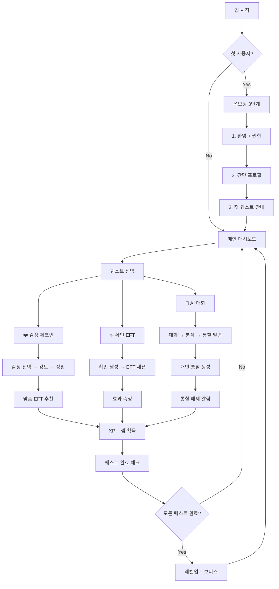
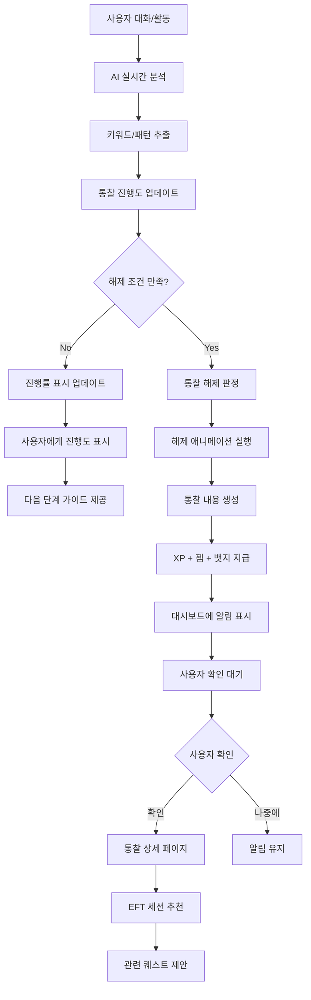
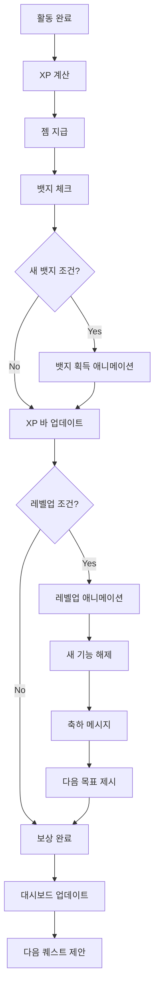

# 최종 RPG 스타일 UI/UX 화면설계 및 시스템 흐름도

**프로젝트**: EFT AI 마음챙김 앱 - RPG 게임 스타일 최종 설계  
**작성일**: 2025년 8월 17일  
**목표**: 통찰-퀘스트 시스템 기반 RPG 게임 UI/UX 완성본

---

## 🎮 **핵심 설계 철학**

### **"RPG 게임하듯 재미있게 마음 관리하기"**
- **통찰 해제 = 레벨업**의 성취감
- **퀘스트 시스템**으로 자연스러운 사용 동기 부여
- **젬/XP/뱃지**로 게임화된 보상 시스템
- **AI 개인화**로 각자만의 모험 스토리

---

## 🏠 **메인 대시보드 (RPG 홈 화면)**

### **최종 확정 레이아웃**
```
┌─────────────────────────────────────┐
│ 🌿 Lv.3 마음탐험가 김민수 💎127 🔔👤│ ← 게임 헤더 (등급+젬+알림)
├─────────────────────────────────────┤
│ ⚡ 오늘의 일일 퀘스트 (2/3 완료) +50XP│ ← 퀘스트 진행도
│ ☑️ 감정 체크인 ☑️ AI 대화 ⬜ 확언 EFT │
│                                   │
│ 🎉 새로운 통찰 해제! 🔓              │ ← 통찰 해제 알림
│ 💎 "미루기 습관 완전 끝내는 법" 생성됨! │
│ [지금 확인하기] [나중에] 🔮          │
│                                   │
│ ┌─────────────────────────────┐   │
│ │ 💬 마음 속 이야기를 들려주세요 │   │ ← 메인 액션 (AI 대화)
│ │    [AI 동반자와 대화 시작]    │   │
│ └─────────────────────────────┘   │
│                                   │
│ 🎯 빠른 시작                        │ ← 3가지 루트 버튼
│ [❤️ 감정체크] [✨ 확언EFT] [🎧 3D가이드] │
│                                   │
│ 🔮 통찰 질문 진행도 (혁신 기능!)     │ ← 통찰 시스템 표시
│ ┌─ 해제완료 ─┬─── 진행중 ────┐    │
│ │✨미루기 끝내기│🔒 돈걱정 15/30 │    │
│ │✨연애패턴분석│🔒 결혼비법 8/30│    │
│ └─────────────┴───────────────┘    │
│                                   │
│ 📊 성장현황 ▓▓▓▓▓░░ 72%           │ ← 레벨업 진행도
│ 🏆 뱃지 7개 | 연속 5일 🔥           │
│                                   │
│ 💡 AI 개인화 추천                   │ ← AI 추천 시스템
│ "최근 패턴 분석 결과, 목요일 오후    │
│  스트레스 관리가 필요해 보여요"      │
│ [스트레스 완화 세션] 🎯             │
└─────────────────────────────────────┘
│🏠홈│❤️체크│💬AI│✨EFT│🔮통찰│👤마이│ ← 하단 네비게이션
└─────────────────────────────────────┘
```

### **UI 구성 요소 상세**

#### **1. 헤더 영역 (게임 정보)**
```
🌿 Lv.3 마음탐험가 김민수 💎127 🔔👤

컴포넌트:
- 등급 아이콘: 🌿 (레벨에 따라 변화)
- 레벨 + 타이틀: "Lv.3 마음탐험가"
- 사용자명: 개인화된 닉네임
- 젬 카운트: 💎127 (실시간 업데이트)
- 알림 버튼: 🔔 (새 통찰 등)
- 프로필: 👤 (설정 메뉴 접근)
```

#### **2. 퀘스트 영역 (동기 부여)**
```
⚡ 오늘의 일일 퀘스트 (2/3 완료) +50XP
☑️ 감정 체크인 ☑️ AI 대화 ⬜ 확언 EFT

기능:
- 진행도 시각화: (2/3 완료)
- XP 보상 표시: +50XP
- 각 퀘스트 상태: ☑️ 완료, ⬜ 미완료
- 호버 시 상세 정보 툴팁
```

#### **3. 통찰 해제 알림 (혁신 기능)**
```
🎉 새로운 통찰 해제! 🔓
💎 "미루기 습관 완전 끝내는 법" 생성됨!
[지금 확인하기] [나중에] 🔮

상호작용:
- 애니메이션: 반짝이는 효과
- CTA 버튼: 즉시 확인 vs 나중에
- 자동 숨김: 3일 후 자동으로 숨겨짐
```

#### **4. 메인 액션 (AI 대화)**
```
┌─────────────────────────────┐
│ 💬 마음 속 이야기를 들려주세요 │
│    [AI 동반자와 대화 시작]    │
└─────────────────────────────┘

디자인:
- 큰 입력창 형태 (구글 검색바 스타일)
- 따뜻한 그라데이션 배경
- 부드러운 rounded corners
- 탭 시 즉시 AI 대화 화면으로 이동
```

#### **5. 빠른 시작 버튼들**
```
🎯 빠른 시작
[❤️ 감정체크] [✨ 확언EFT] [🎧 3D가이드]

레이아웃:
- 3개 버튼 수평 배치
- 각각 다른 브랜드 컬러
- 아이콘 + 텍스트 조합
- 게임 스킬 버튼 스타일
```

#### **6. 통찰 진행도 (핵심 차별화)**
```
🔮 통찰 질문 진행도 (혁신 기능!)
┌─ 해제완료 ─┬─── 진행중 ────┐
│✨미루기 끝내기│🔒 돈걱정 15/30 │
│✨연애패턴분석│🔒 결혼비법 8/30│
└─────────────┴───────────────┘

상태 표시:
- ✨ 해제 완료: 골드 컬러 + 반짝임
- 🔒 진행 중: 프로그레스바 + 수치
- 진행률: 15/30 (현재/목표)
- 탭하면 상세 정보 모달 표시
```

#### **7. 성장 현황 (게임화 핵심)**
```
📊 성장현황 ▓▓▓▓▓░░ 72%
🏆 뱃지 7개 | 연속 5일 🔥

요소:
- XP 바: 다음 레벨까지 진행도
- 퍼센트 표시: 72%
- 뱃지 카운트: 수집 욕구 자극
- 연속 기록: 스트릭 시스템
```

#### **8. AI 개인화 추천**
```
💡 AI 개인화 추천
"최근 패턴 분석 결과, 목요일 오후
 스트레스 관리가 필요해 보여요"
[스트레스 완화 세션] 🎯

특징:
- 개인 맞춤 메시지
- 구체적 행동 제안
- 즉시 실행 가능한 CTA
- 사용할수록 더 정확해짐
```

---

## 🔄 **시스템 흐름도**

### **전체 사용자 플로우**


### **통찰 해제 플로우**


### **게임화 보상 플로우**


---

## 📱 **주요 화면별 상세 설계**

### **1. 온보딩 시퀀스 (3단계)**

#### **1-1. 환영 화면**
```
┌─────────────────────────────────────┐
│                                   │
│           🌟 환영합니다! 🌟         │
│                                   │
│         EFT 마음챙김 모험가         │
│                                   │
│       "게임하듯 재미있게             │
│        마음 관리를 시작해보세요"      │
│                                   │
│        🎮 RPG 스타일 심리케어        │
│        🔮 AI가 분석하는 개인 통찰     │
│        🏆 레벨업하며 성장하기        │
│                                   │
│                                   │
│         [모험 시작하기] 🚀           │
│                                   │
│     "3분이면 준비 완료됩니다"        │
└─────────────────────────────────────┘
```

#### **1-2. 간단 프로필 설정**
```
┌─────────────────────────────────────┐
│        🎯 모험가 등록하기            │
├─────────────────────────────────────┤
│                                   │
│ 닉네임: [마음탐험가_____]           │
│                                   │
│ 주로 언제 사용하실 예정인가요?        │
│ ○ 🌅 아침 (에너지 충전)            │
│ ○ ☀️ 점심 (스트레스 해소)          │
│ ○ 🌙 저녁 (하루 정리)              │
│                                   │
│ 가장 관심 있는 영역은? (복수 선택)    │
│ ☑️ 💕 연애와 인간관계              │
│ ☑️ 💰 성공과 자기계발              │
│ □ 😌 감정관리와 스트레스            │
│ □ 🎯 목표달성과 동기부여            │
│                                   │
│ 🔒 개인정보 수집 동의               │
│ ☑️ 개인화 서비스 제공 (필수)        │
│ ☑️ 서비스 개선을 위한 익명 분석      │
│                                   │
│        [모험 시작하기] 🎮           │
└─────────────────────────────────────┘
```

#### **1-3. 첫 퀘스트 안내**
```
┌─────────────────────────────────────┐
│         🎮 첫 번째 퀘스트!           │
├─────────────────────────────────────┤
│                                   │
│      🌱 "마음 모험가 되기"           │
│                                   │
│ 📋 미션:                            │
│ 1. ❤️ 첫 번째 감정 체크인 (+50 XP)   │
│ 2. 💬 AI 동반자 첫 만남 (+75 XP)    │
│ 3. ✨ 확언 EFT 체험하기 (+25 XP)    │
│                                   │
│ 🎁 완료 보상:                       │
│ • 🏅 "새싹 모험가" 뱃지             │
│ • 💎 보너스 젬 100개               │
│ • 🔓 첫 번째 통찰 질문 해제          │
│                                   │
│ 💡 각 미션은 5-10분 정도 걸려요      │
│                                   │
│     [첫 번째 미션 시작] 🚀          │
│     [건너뛰고 둘러보기]             │
└─────────────────────────────────────┘
```

### **2. AI 대화 화면**
```
┌─────────────────────────────────────┐
│ ← 💬 AI 동반자 대화          ⚚ 📤  │
├─────────────────────────────────────┤
│                                   │
│ 🤖 AI: 안녕하세요! 오늘은 어떤       │
│        마음으로 오셨나요? 😊        │
│                                   │
│ 😊 You: 오늘 회사에서 너무           │
│         스트레스 받았어요...         │
│                                   │
│ 🤖 AI: 힘드셨겠어요. 어떤 상황이     │
│        가장 부담스러우셨나요?        │
│                                   │
│ 😊 You: 상사가 계속 야근을 시켜서    │
│         지쳤어요                   │
│                                   │
│ 🧠 [AI 분석 중... 패턴 감지]        │
│                                   │
│ 🤖 AI: 이런 상황이 자주             │
│        반복되시는 것 같네요.         │
│        혹시 어릴 때 비슷한...        │
│                                   │
│ ┌─────────────────────────────┐   │
│ │ 메시지 입력...              │   │
│ │                      [전송] │   │
│ └─────────────────────────────┘   │
│                                   │
│ 💡 퀘스트 진행도: AI 대화 ✅ 완료     │
│ 🎁 +30 XP 획득!                   │
└─────────────────────────────────────┘
```

### **3. 감정 체크인 화면**
```
┌─────────────────────────────────────┐
│ ← ❤️ 감정 체크인               🎯   │
├─────────────────────────────────────┤
│                                   │
│     지금 어떤 감정이 가장 크신가요?   │
│                                   │
│ ┌─────┬─────┬─────┬─────┐         │
│ │ 😰  │ 😔  │ 😡  │ 🤗  │         │
│ │스트레│ 슬픔 │ 분노 │ 기쁨 │         │
│ │ 스   │     │     │     │         │
│ └─────┴─────┴─────┴─────┘         │
│                                   │
│ ┌─────┬─────┬─────┬─────┐         │
│ │ 😟  │ 😤  │ 😳  │ 🤔  │         │
│ │ 불안 │좌절감│수치심│ 혼란 │         │
│ └─────┴─────┴─────┴─────┘         │
│                                   │
│ ✨ 선택됨: 스트레스 😰               │
│                                   │
│ 얼마나 강하게 느끼시나요?             │
│ ●●●●●●●○○○ 7/10 (강함)           │
│                                   │
│ ┌─────────────────────────────┐   │
│ │ 어떤 상황 때문인지 간단히     │   │
│ │ 적어보세요 (선택사항)         │   │
│ └─────────────────────────────┘   │
│                                   │
│ 💡 퀘스트 진행도: 감정 체크인 ✅ 완료  │
│ 🎁 +25 XP 획득!                   │
│                                   │
│       [맞춤 EFT 추천받기] 🎯        │
└─────────────────────────────────────┘
```

### **4. 통찰 상세 화면**
```
┌─────────────────────────────────────┐
│ ← 🔮 미루기 습관 완전 끝내는 법       │
├─────────────────────────────────────┤
│                                   │
│ 🎉 축하합니다! 새로운 통찰 해제!     │
│                                   │
│ 🧠 AI 분석 결과 (신뢰도 89%)        │
│                                   │
│ 📊 당신의 미루기 패턴:               │
│ • 트리거: 어려운 일 + 시간 압박       │
│ • 반응: 불안 → 회피 → 자책           │
│ • 근본 원인: 완벽주의 + 실패 두려움   │
│                                   │
│ 💡 맞춤 솔루션:                     │
│ 1. 🎯 "5분 규칙" - 일단 5분만 시작   │
│ 2. 🧘 미루고 싶을 때 EFT 기법        │
│ 3. 🔄 작은 성공 경험 쌓기           │
│                                   │
│ ✨ 추천 EFT 세션:                   │
│ • "완벽주의 내려놓기" (15분)         │
│ • "실행력 강화" 확언 EFT (10분)      │
│                                   │
│ 🏆 획득 보상:                       │
│ • 💎 +200 XP                      │
│ • 🏅 "실행력 마스터" 뱃지           │
│ • 🔓 "시간관리 완전정복" 통찰 20% 진행│
│                                   │
│ [맞춤 EFT 시작] [결과 공유] [저장]   │
└─────────────────────────────────────┘
```

### **5. 레벨업 화면**
```
┌─────────────────────────────────────┐
│                                   │
│         🎉 레벨업! 🎉               │
│                                   │
│      ✨✨✨ 축하합니다! ✨✨✨        │
│                                   │
│        🌿 Lv.2 → 🌳 Lv.3           │
│       감정탐험가 → 마음탐험가         │
│                                   │
│ 🎁 레벨업 보상:                     │
│ • 💎 보너스 젬 300개               │
│ • 🔓 새로운 통찰 영역 해제           │
│ • 🎨 전용 테마 "숲속 여행" 해제      │
│ • ⚡ 에너지 회복량 20% 증가          │
│                                   │
│ 🔮 새로 해제된 통찰들:               │
│ • "💰 돈 걱정 안 하고 살려면?"       │
│ • "🤝 갈등을 기회로 바꾸는 대화법"    │
│ • "💪 번아웃 없이 워라밸 관리법"      │
│                                   │
│ 🎯 다음 레벨까지: 847 XP 남음        │
│                                   │
│       [새 기능 둘러보기] 🌟         │
│       [계속 모험하기] 🚀            │
└─────────────────────────────────────┘
```

---

## 🎨 **디자인 시스템**

### **컬러 팔레트 (RPG 게임 스타일)**
```css
/* 메인 브랜드 컬러 */
:root {
  --primary-blue: #6366F1;      /* 신뢰감 있는 게임 블루 */
  --secondary-purple: #8B5CF6;   /* 마법/통찰의 보라색 */
  --accent-gold: #F59E0B;        /* 젬/보상의 골드색 */
  --success-green: #10B981;      /* 완료/성공의 그린 */
  --warning-red: #EF4444;        /* 긴급/중요의 레드 */
  
  /* 게임 요소 전용 컬러 */
  --xp-gradient: linear-gradient(90deg, #6366F1, #8B5CF6);
  --gem-gold: linear-gradient(45deg, #F59E0B, #FBBF24);
  --level-glow: 0 0 20px rgba(99, 102, 241, 0.3);
  --unlock-flash: 0 0 30px rgba(245, 158, 11, 0.6);
  
  /* 배경 및 서피스 */
  --bg-primary: #FFFFFF;
  --bg-secondary: #F8FAFC;
  --bg-game-card: linear-gradient(135deg, #F8FAFC, #E2E8F0);
  --surface-elevated: #FFFFFF;
  
  /* 텍스트 컬러 */
  --text-primary: #1E293B;
  --text-secondary: #64748B;
  --text-accent: #6366F1;
}
```

### **타이포그래피**
```css
/* 게임 스타일 폰트 시스템 */
.font-game-title {
  font-family: 'Pretendard', -apple-system, sans-serif;
  font-weight: 700;
  font-size: 24px;
  line-height: 1.2;
  letter-spacing: -0.02em;
}

.font-game-subtitle {
  font-family: 'Pretendard', -apple-system, sans-serif;
  font-weight: 600;
  font-size: 18px;
  line-height: 1.3;
}

.font-game-body {
  font-family: 'Pretendard', -apple-system, sans-serif;
  font-weight: 400;
  font-size: 16px;
  line-height: 1.5;
}

.font-game-caption {
  font-family: 'Pretendard', -apple-system, sans-serif;
  font-weight: 500;
  font-size: 14px;
  line-height: 1.4;
}

/* 특별 효과 폰트 */
.font-level-display {
  font-weight: 800;
  background: var(--xp-gradient);
  -webkit-background-clip: text;
  -webkit-text-fill-color: transparent;
  text-shadow: var(--level-glow);
}
```

### **게임 애니메이션 효과**
```css
/* 레벨업 애니메이션 */
@keyframes levelUpGlow {
  0% {
    transform: scale(1);
    box-shadow: 0 0 20px rgba(245, 158, 11, 0.3);
  }
  50% {
    transform: scale(1.05);
    box-shadow: 0 0 40px rgba(245, 158, 11, 0.8);
  }
  100% {
    transform: scale(1);
    box-shadow: 0 0 20px rgba(245, 158, 11, 0.3);
  }
}

/* 통찰 해제 애니메이션 */
@keyframes insightUnlock {
  0% {
    opacity: 0;
    transform: scale(0.8) rotateY(-90deg);
  }
  50% {
    opacity: 1;
    transform: scale(1.1) rotateY(0deg);
  }
  100% {
    opacity: 1;
    transform: scale(1) rotateY(0deg);
  }
}

/* XP 획득 애니메이션 */
@keyframes xpGain {
  0% {
    transform: translateY(0) scale(1);
    opacity: 1;
  }
  100% {
    transform: translateY(-50px) scale(1.2);
    opacity: 0;
  }
}

/* 젬 반짝임 효과 */
@keyframes gemSparkle {
  0%, 100% {
    filter: brightness(1) drop-shadow(0 0 5px rgba(245, 158, 11, 0.3));
  }
  50% {
    filter: brightness(1.3) drop-shadow(0 0 15px rgba(245, 158, 11, 0.8));
  }
}

/* 퀘스트 완료 체크 애니메이션 */
@keyframes questComplete {
  0% {
    transform: scale(0);
    opacity: 0;
  }
  50% {
    transform: scale(1.3);
    opacity: 1;
  }
  100% {
    transform: scale(1);
    opacity: 1;
  }
}
```

### **컴포넌트 스타일**
```css
/* 게임 스타일 카드 */
.game-card {
  background: var(--bg-game-card);
  border-radius: 16px;
  padding: 24px;
  box-shadow: 
    0 4px 12px rgba(0, 0, 0, 0.05),
    0 0 0 1px rgba(255, 255, 255, 0.1);
  transition: all 0.3s ease;
}

.game-card:hover {
  transform: translateY(-4px);
  box-shadow: 
    0 8px 24px rgba(0, 0, 0, 0.1),
    0 0 0 1px rgba(99, 102, 241, 0.2);
}

/* 퀘스트 버튼 */
.quest-button {
  background: var(--xp-gradient);
  color: white;
  border: none;
  border-radius: 12px;
  padding: 16px 24px;
  font-weight: 600;
  cursor: pointer;
  transition: all 0.2s ease;
  position: relative;
  overflow: hidden;
}

.quest-button:hover {
  transform: translateY(-2px);
  box-shadow: 0 8px 20px rgba(99, 102, 241, 0.3);
}

.quest-button:active {
  transform: translateY(0);
}

/* 통찰 진행바 */
.insight-progress {
  background: #E2E8F0;
  border-radius: 8px;
  height: 8px;
  overflow: hidden;
  position: relative;
}

.insight-progress-fill {
  background: var(--xp-gradient);
  height: 100%;
  transition: width 0.8s ease;
  position: relative;
}

.insight-progress-fill::after {
  content: '';
  position: absolute;
  top: 0;
  left: 0;
  right: 0;
  bottom: 0;
  background: linear-gradient(
    90deg,
    transparent,
    rgba(255, 255, 255, 0.4),
    transparent
  );
  animation: progressShine 2s infinite;
}

@keyframes progressShine {
  0% { transform: translateX(-100%); }
  100% { transform: translateX(100%); }
}
```

---

## 📱 **반응형 디자인**

### **모바일 (320px - 768px)**
```css
@media (max-width: 768px) {
  .dashboard-container {
    padding: 16px;
    gap: 16px;
  }
  
  .quest-buttons {
    flex-direction: column;
    gap: 12px;
  }
  
  .insight-grid {
    grid-template-columns: 1fr;
    gap: 16px;
  }
  
  .game-header {
    font-size: 18px;
    padding: 12px 16px;
  }
  
  .quick-actions {
    grid-template-columns: 1fr;
    gap: 12px;
  }
}
```

### **태블릿 (768px - 1024px)**
```css
@media (min-width: 768px) and (max-width: 1024px) {
  .dashboard-container {
    padding: 24px;
    max-width: 720px;
    margin: 0 auto;
  }
  
  .quest-buttons {
    grid-template-columns: repeat(2, 1fr);
    gap: 16px;
  }
  
  .insight-grid {
    grid-template-columns: repeat(2, 1fr);
    gap: 20px;
  }
}
```

### **데스크톱 (1024px+)**
```css
@media (min-width: 1024px) {
  .dashboard-container {
    padding: 32px;
    max-width: 1200px;
    margin: 0 auto;
    display: grid;
    grid-template-columns: 2fr 1fr;
    gap: 32px;
  }
  
  .main-content {
    grid-column: 1;
  }
  
  .sidebar-content {
    grid-column: 2;
  }
  
  .quest-buttons {
    grid-template-columns: repeat(3, 1fr);
    gap: 20px;
  }
}
```

---

## 🎯 **성능 최적화**

### **로딩 최적화**
```javascript
// 이미지 lazy loading
const lazyImages = document.querySelectorAll('.lazy-image');
const imageObserver = new IntersectionObserver((entries) => {
  entries.forEach(entry => {
    if (entry.isIntersecting) {
      const img = entry.target;
      img.src = img.dataset.src;
      img.classList.remove('lazy-image');
      imageObserver.unobserve(img);
    }
  });
});

// 애니메이션 성능 최적화
const prefersReducedMotion = window.matchMedia('(prefers-reduced-motion: reduce)');
if (prefersReducedMotion.matches) {
  document.body.classList.add('reduce-motion');
}

// 컴포넌트 가상화 (긴 목록)
const virtualizedList = new VirtualizedList({
  container: '.insight-list',
  itemHeight: 120,
  overscan: 5
});
```

### **상태 관리 최적화**
```javascript
// React 최적화 예시
const DashboardMemo = React.memo(Dashboard, (prevProps, nextProps) => {
  return prevProps.userLevel === nextProps.userLevel &&
         prevProps.quests === nextProps.quests;
});

// 리렌더링 최소화
const useOptimizedState = () => {
  const [state, setState] = useState({
    level: 1,
    xp: 0,
    gems: 0,
    quests: []
  });
  
  const updateLevel = useCallback((newLevel) => {
    setState(prev => ({ ...prev, level: newLevel }));
  }, []);
  
  return { state, updateLevel };
};
```

---

**🎯 결론: 이 RPG 스타일 UI/UX 설계로 사용자들이 게임하듯 재미있게 마음 관리를 할 수 있는 혁신적인 앱이 완성됩니다!**